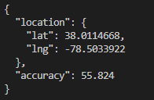
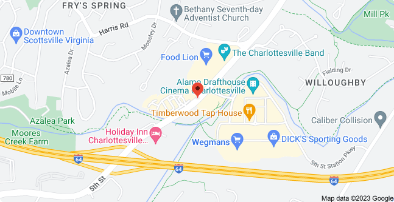

[](https://gitpod.io/#https://github.com/hortinstein/geomanko/) 

# GeoManko


### Intricate or detailed as a manko

### Problem 
```
We've noticed that one of the mobile applications on an employee device has been sending some interesting data to the cloud. [Here's an example of one of the uploads](https://metaproblems.com/0d96db28b305a8f2504d7a9f9be044c0/phonedata.json).

The app doesn't have permission to see the user location ... but it might be tracking it anyway. Can you find where the user was when that data was recorded?

Please submit the flag as decimal latitude and longitude coordinates separated by a comma. The answer must be correct to within 2 decimal places. Example flags: 37.81913, -122.47845, 1.2818779, 103.8638950, and -18.9298, 47.5259
```
### [solution walk through here](GeoManko.ipynb)


[Location](https://www.google.com/maps/place/38%C2%B000'41.3%22N+78%C2%B030'12.2%22W/@38.0114668,-78.5033922,17z/data=!3m1!4b1!4m4!3m3!8m2!3d38.0114668!4d-78.5033922?entry=ttu)





Ensure you follow the setup directions there to get the api key before following these steps:
```
pip install python-dotenv requests
```

Edit a `.env` file or change the api key in `GeoManko.py`

Run the script
```
python GeoManko.py
```
